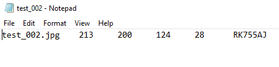

# Analýza dát

## Získanie datasetu

Témou nášho projektu je "object recognition" so zameraním na EČV. V skratke, natrénovaná neurónová sieť by mala byť z obrázku schopná rozoznať, kde sa nachádza EČV. Na natrénovanie takejto neurónovej siete sme samozrejme potrebovali vhodný dataset. Spravili sme si prieskum a zistili sme, že na trénovanie NS na rozpoznávanie EČV používajú viaceré zdroje dataset so 100 - 500 obrázkami. Vedeli sme, že najideálnejšie by pre nás bolo nájsť dataset so slovenskými EČV (alebo aspoň európskymi). Taktiež sme sa nebránili ani možnosti vyrobiť a olabelovať si vlastný dataset, no neuprednostňovali sme ju kvôli časovej náročnosti. Po stanovení požiadaviek na náš dataset sme sa pustili do hľadania a výsledkom bol približne 100 obrázkový olabelovaný dataset so slovenskými EČV.

## Analýza datasetu

*   108 obrázkov (82 slovenských + 15 českých + 11 zahraničných) na ktorých sú vozidlá s EČV
*   108 textových súborov s metadátami o každom obrázku

### Analýza obrázkov

Obrázky v tomto datasete neobsahujú bounding boxy, informácie o polohe a veľkosti EČV sa nachádzajú v textovom súbore s rovnakým názvom, ako je meno obrázku ku ktorému patria. Štruktúru metadát si opíšeme v ďalšej časti.

```
Priemerna sirka a vyska obrazku: [516.78, 388.69]
Standardna odchylka sirky a vysky obrazku: [195.92, 142.37]
Priemerna poloha laveho horneho rohu ECV: [191.78, 212.99]
Standardna odchylka polohy laveho horneho rohu ECV: [92.59, 95.60]
Priemerna sirka a vyska ECV: [121.64, 27.66]
Standardna odchylka sirky a vysky ECV: [51.85, 11.94]
```

Tieto hodnoty sme vypočítali pomocou nasledujúceho skriptu:
```javascript
const path = require('path');
const fs = require('fs');
const math = require('mathjs');
const sizeOf = require('image-size');
const directoryPath = 'C:\\Users\\Predu\\Skola\\NSIETE\\Projekt\\nsiete\\data\\dataset';
var EXTENSIONTXT = '.txt';
var leftX = [], topY = [], widthECV = [], heightECV = [], heightImg = [], widthImg = [];

fs.readdir(directoryPath, function (err, files) {

    if (err) {
        return console.log('Unable to scan directory: ' + err);
    }

    var targetFiles = files.filter(function(file) {
      return path.extname(file).toLowerCase() === EXTENSIONTXT;
    });

    var targetImgs = files.filter(function(file) {
      return path.extname(file).toLowerCase() !== EXTENSIONTXT;
    });

    targetFiles.forEach(function (file) {

        fs.readFile(path.join(directoryPath, file), (err, data) => {

          if (err) {
            return console.log('Unable to open file: ' + err);
          }

          var splitted = data.toString().match(/\S+/g);
          leftX.push(parseInt(splitted[1]));
          topY.push(parseInt(splitted[2]));
          widthECV.push(parseInt(splitted[3]));
          heightECV.push(parseInt(splitted[4]));
          
        });
    });

    targetImgs.forEach(function (file) {
      
        var dimensions = sizeOf(path.join(directoryPath, file));
        heightImg.push(dimensions.height);
        widthImg.push(dimensions.width);
        
    });

    setTimeout(function(){
      console.log("Priemerna sirka a vyska obrazku: [" + math.mean(widthImg).toFixed(2) + ", "+ math.mean(heightImg).toFixed(2) +"]");
      console.log("Standardna odchylka sirky a vysky obrazku: [" + math.std(widthImg).toFixed(2) + ", "+ math.std(heightImg).toFixed(2) +"]");
      console.log("Priemerna poloha laveho horneho rohu ECV: [" + math.mean(leftX).toFixed(2) + ", "+ math.mean(topY).toFixed(2) +"]");
      console.log("Standardna odchylka polohy laveho horneho rohu ECV: [" + math.std(leftX).toFixed(2) + ", "+ math.std(topY).toFixed(2) +"]");
      console.log("Priemerna sirka a vyska ECV: [" + math.mean(widthECV).toFixed(2) + ", "+ math.mean(heightECV).toFixed(2) +"]");
      console.log("Standardna odchylka sirky a vysky ECV: [" + math.std(widthECV).toFixed(2) + ", "+ math.std(heightECV).toFixed(2) +"]");
    }, 1000);
});

```


### Analýza textových súborov

V textových súboroch sa nachádzajú metadáta k jednotlivým obrázkom - čo textový súbor, to jeden obrázok. Dáta v textových súboroch boli v nasledovnej štruktúre.



Textový súbor obsahuje 6 hodnôt oddelených tabulátorom. Popis jednotlivých hodnôt:
1. text - názov súboru
2. číslo - X-ová súradnica ľavého horného rohu pomyselného bounding boxu okolo EČV
3. číslo - Y-ová súradnica ľavého horného rohu pomyselného bounding boxu okolo EČV
4. číslo - šírka pomyselného bounding boxu okolo EČV
5. číslo - výška pomyselného bounding boxu okolo EČV
6. text - nápis na EČV


### Obmedzenia

Na začiatku sme si neboli istí, či by obrázky nemali mať rovnakú veľkosť, no po natrénovaní sa ukázalo, že object detection funguje dobre, aj keď sa natrénuje na rôzne veľkých obrázkoch. Ďalším problémom by mohlo byť, že EČV sa vo väčšine trénovacích obrázkov nachádza v dolnej polovici v strede, no táto domnieka sa nám zatiaľ nepotvrdila ani nevyvrátila.

## Predspracovanie dát

Na to, aby sme dátami mohli "nakŕmiť" NS sme ich potrebovali pripraviť do takého formátu, ktorému NS rozumie. Dáta z textových súborov sme najprv museli upraviť do CSV formátu s hlavičkou.

```python
import csv
import glob

outFile = open('testLabels.csv', 'w', newline='')
writer = csv.writer(outFile, dialect=csv.excel)
header = ['filename', 'leftX', 'topY', 'width', 'height', 'plateNumber']
writer.writerow(header)
 
for file in glob.glob('data/test/*.txt'):
    with open(file, 'r') as fin:
        reader = csv.reader(fin)
        line = next(reader)
        splitLine = line[0].split()
        writer.writerow(splitLine)
```

Následne sme aj textové aj obráykové dáta rozdelili na trénovaciu a testovaciu množinu v pomere približne 10:1. Ďalším krokom bolo pripraviť label mapu, ktorá bola v našom prípade veľmi jednoduchá, keďže rozpoznávame len jeden typ objektu.

```JSON
item {
	id: 1
	name: 'licensePlate'
}
```
Nakoniec sme z dát vytvorili TFRecord file, ktorému NS rozumie a vie sa z neho učiť.

```python
import tensorflow as tf
import os
import io
import pandas as pd
from collections import namedtuple, OrderedDict
from PIL import Image

def split(df, group):
    data = namedtuple('data', ['filename', 'object'])
    gb = df.groupby(group)
    return [data(filename, gb.get_group(x)) for filename, x in zip(gb.groups.keys(), gb.groups)]

def create_tf_record(group, path):
    with tf.io.gfile.GFile(os.path.join(path, '{}'.format(group.filename)), 'rb') as fid:
        encoded_jpg = fid.read()
    encoded_jpg_io = io.BytesIO(encoded_jpg)
    image = Image.open(encoded_jpg_io)
    width, height = image.size

    filename = group.filename.encode('utf8')
    image_format = b'jpg'
    xmins = []
    xmaxs = []
    ymins = []
    ymaxs = []
    classes_text = []
    classes = []

    for index, row in group.object.iterrows():
        xmins.append(row['leftX'] / width)
        xmaxs.append((row['leftX'] + row['width']) / width)
        ymins.append(row['topY'] / height)
        ymaxs.append((row['topY'] + row['height']) / height)
        classes_text.append(b"licensePlate")
        classes.append(1)

    tf_example = tf.train.Example(features=tf.train.Features(feature={
        'image/height': tf.train.Feature(int64_list=tf.train.Int64List(value=[height])),
        'image/width': tf.train.Feature(int64_list=tf.train.Int64List(value=[width])),
        'image/filename': tf.train.Feature(bytes_list=tf.train.BytesList(value=[filename])),
        'image/source_id': tf.train.Feature(bytes_list=tf.train.BytesList(value=[filename])),
        'image/encoded': tf.train.Feature(bytes_list=tf.train.BytesList(value=[encoded_jpg])),
        'image/format': tf.train.Feature(bytes_list=tf.train.BytesList(value=[image_format])),
        'image/object/bbox/xmin': tf.train.Feature(float_list=tf.train.FloatList(value=xmins)),
        'image/object/bbox/xmax': tf.train.Feature(float_list=tf.train.FloatList(value=xmaxs)),
        'image/object/bbox/ymin': tf.train.Feature(float_list=tf.train.FloatList(value=ymins)),
        'image/object/bbox/ymax': tf.train.Feature(float_list=tf.train.FloatList(value=ymaxs)),
        'image/object/class/text': tf.train.Feature(bytes_list=tf.train.BytesList(value=classes_text)),
        'image/object/class/label': tf.train.Feature(int64_list=tf.train.Int64List(value=classes))
    }))
    return tf_example

def main():
    writer = tf.io.TFRecordWriter('testRecord')
    img_path = os.path.join('data/test/')
    labels = pd.read_csv('testLabels.csv')
    grouped = split(labels, 'filename')

    for group in grouped:
        tf_example = create_tf_record(group, img_path)
        writer.write(tf_example.SerializeToString())

    writer.close()

main()
```

Pri trénovaní sme používali funkcie z ObjectDetection API a pre architektúru NS sme zatiaľ zvolili Faster R-CNN, keďže je vhodná aj na real-time rozpoznávanie. Takisto je na real-time rozpoznávanie vhodná aj YOLO architektúra, ktorú by sme chceli použiť vo výslednom riešení.