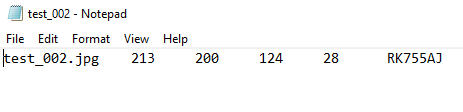
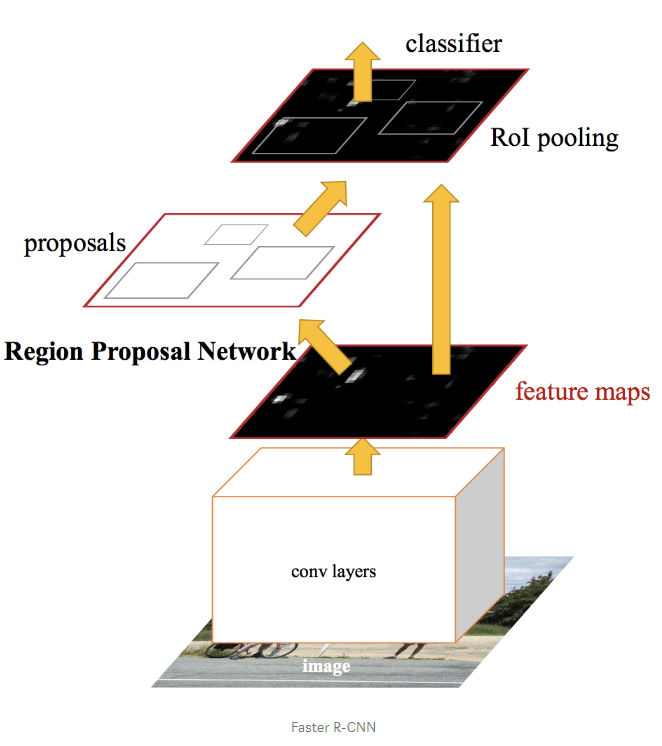
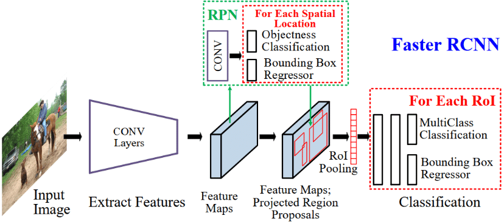
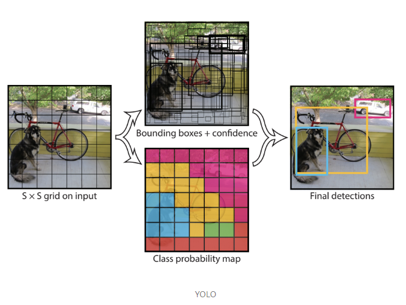
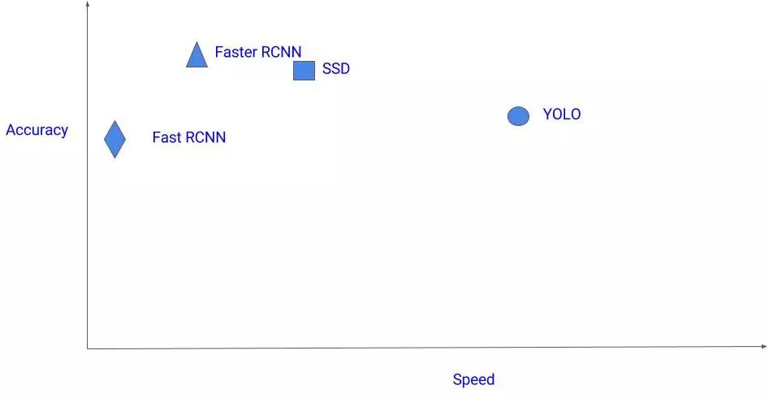
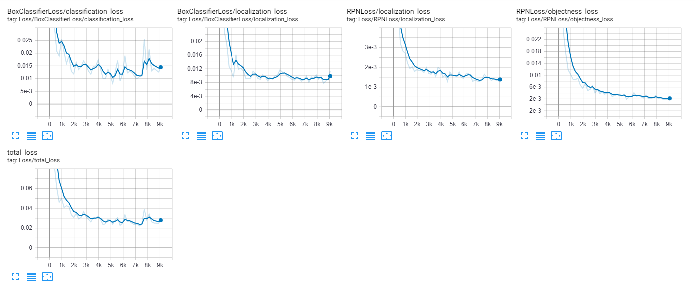

# Neurónové siete - automatická detekcia EČV z obrázku

## Získanie datasetu

Témou nášho projektu je "object recognition" so zameraním na EČV. V skratke, natrénovaná neurónová sieť by mala byť z obrázku schopná rozoznať, kde sa nachádza EČV. Na natrénovanie takejto neurónovej siete sme samozrejme potrebovali vhodný dataset. Spravili sme si prieskum a zistili sme, že na trénovanie NS na rozpoznávanie EČV používajú viaceré zdroje dataset so 100 - 500 obrázkami. Vedeli sme, že najideálnejšie by pre nás bolo nájsť dataset so slovenskými EČV (alebo aspoň európskymi). Taktiež sme sa nebránili ani možnosti vyrobiť a olabelovať si vlastný dataset, no neuprednostňovali sme ju kvôli časovej náročnosti. Po stanovení požiadaviek na náš dataset sme sa pustili do hľadania a výsledkom bol približne 100 obrázkový olabelovaný dataset so slovenskými EČV.

## Analýza datasetu

*   108 obrázkov (82 slovenských + 15 českých + 11 zahraničných) na ktorých sú vozidlá s EČV
*   108 textových súborov s metadátami o každom obrázku

### Analýza obrázkov

Obrázky v tomto datasete neobsahujú bounding boxy, informácie o polohe a veľkosti EČV sa nachádzajú v textovom súbore s rovnakým názvom, ako je meno obrázku ku ktorému patria. Štruktúru metadát si opíšeme v ďalšej časti.

```
Priemerna sirka a vyska obrazku: [516.78, 388.69]
Standardna odchylka sirky a vysky obrazku: [195.92, 142.37]
Priemerna poloha laveho horneho rohu ECV: [191.78, 212.99]
Standardna odchylka polohy laveho horneho rohu ECV: [92.59, 95.60]
Priemerna sirka a vyska ECV: [121.64, 27.66]
Standardna odchylka sirky a vysky ECV: [51.85, 11.94]
```

Tieto hodnoty sme vypočítali pomocou nasledujúceho skriptu:
```javascript
const path = require('path');
const fs = require('fs');
const math = require('mathjs');
const sizeOf = require('image-size');
const directoryPath = 'C:\\Users\\Predu\\Skola\\NSIETE\\Projekt\\nsiete\\data\\dataset';
var EXTENSIONTXT = '.txt';
var leftX = [], topY = [], widthECV = [], heightECV = [], heightImg = [], widthImg = [];

fs.readdir(directoryPath, function (err, files) {

    if (err) {
        return console.log('Unable to scan directory: ' + err);
    }

    var targetFiles = files.filter(function(file) {
      return path.extname(file).toLowerCase() === EXTENSIONTXT;
    });

    var targetImgs = files.filter(function(file) {
      return path.extname(file).toLowerCase() !== EXTENSIONTXT;
    });

    targetFiles.forEach(function (file) {

        fs.readFile(path.join(directoryPath, file), (err, data) => {

          if (err) {
            return console.log('Unable to open file: ' + err);
          }

          var splitted = data.toString().match(/\S+/g);
          leftX.push(parseInt(splitted[1]));
          topY.push(parseInt(splitted[2]));
          widthECV.push(parseInt(splitted[3]));
          heightECV.push(parseInt(splitted[4]));
          
        });
    });

    targetImgs.forEach(function (file) {
      
        var dimensions = sizeOf(path.join(directoryPath, file));
        heightImg.push(dimensions.height);
        widthImg.push(dimensions.width);
        
    });

    setTimeout(function(){
      console.log("Priemerna sirka a vyska obrazku: [" + math.mean(widthImg).toFixed(2) + ", "+ math.mean(heightImg).toFixed(2) +"]");
      console.log("Standardna odchylka sirky a vysky obrazku: [" + math.std(widthImg).toFixed(2) + ", "+ math.std(heightImg).toFixed(2) +"]");
      console.log("Priemerna poloha laveho horneho rohu ECV: [" + math.mean(leftX).toFixed(2) + ", "+ math.mean(topY).toFixed(2) +"]");
      console.log("Standardna odchylka polohy laveho horneho rohu ECV: [" + math.std(leftX).toFixed(2) + ", "+ math.std(topY).toFixed(2) +"]");
      console.log("Priemerna sirka a vyska ECV: [" + math.mean(widthECV).toFixed(2) + ", "+ math.mean(heightECV).toFixed(2) +"]");
      console.log("Standardna odchylka sirky a vysky ECV: [" + math.std(widthECV).toFixed(2) + ", "+ math.std(heightECV).toFixed(2) +"]");
    }, 1000);
});

```


### Analýza textových súborov

V textových súboroch sa nachádzajú metadáta k jednotlivým obrázkom - čo textový súbor, to jeden obrázok. Dáta v textových súboroch boli v nasledovnej štruktúre.



Textový súbor obsahuje 6 hodnôt oddelených tabulátorom. Popis jednotlivých hodnôt:
1. text - názov súboru
2. číslo - X-ová súradnica ľavého horného rohu pomyselného bounding boxu okolo EČV
3. číslo - Y-ová súradnica ľavého horného rohu pomyselného bounding boxu okolo EČV
4. číslo - šírka pomyselného bounding boxu okolo EČV
5. číslo - výška pomyselného bounding boxu okolo EČV
6. text - nápis na EČV


### Obmedzenia

Na začiatku sme si neboli istí, či by obrázky nemali mať rovnakú veľkosť, no po natrénovaní sa ukázalo, že object detection funguje dobre, aj keď sa natrénuje na rôzne veľkých obrázkoch. Ďalším problémom by mohlo byť, že EČV sa vo väčšine trénovacích obrázkov nachádza v dolnej polovici v strede, no táto domnieka sa nám zatiaľ nepotvrdila ani nevyvrátila.

## Predspracovanie dát

Na to, aby sme dátami mohli "nakŕmiť" NS sme ich potrebovali pripraviť do takého formátu, ktorému NS rozumie. Dáta z textových súborov sme najprv museli upraviť do CSV formátu s hlavičkou.

```python
import csv
import glob

outFile = open('testLabels.csv', 'w', newline='')
writer = csv.writer(outFile, dialect=csv.excel)
header = ['filename', 'leftX', 'topY', 'width', 'height', 'plateNumber']
writer.writerow(header)
 
for file in glob.glob('data/test/*.txt'):
    with open(file, 'r') as fin:
        reader = csv.reader(fin)
        line = next(reader)
        splitLine = line[0].split()
        writer.writerow(splitLine)
```

Následne sme aj textové aj obráykové dáta rozdelili na trénovaciu a testovaciu množinu v pomere približne 10:1. Ďalším krokom bolo pripraviť label mapu, ktorá bola v našom prípade veľmi jednoduchá, keďže rozpoznávame len jeden typ objektu.

```JSON
item {
	id: 1
	name: 'licensePlate'
}
```
Nakoniec sme z dát vytvorili TFRecord file, ktorému NS rozumie a vie sa z neho učiť.

```python
import tensorflow as tf
import os
import io
import pandas as pd
from collections import namedtuple, OrderedDict
from PIL import Image

def split(df, group):
    data = namedtuple('data', ['filename', 'object'])
    gb = df.groupby(group)
    return [data(filename, gb.get_group(x)) for filename, x in zip(gb.groups.keys(), gb.groups)]

def create_tf_record(group, path):
    with tf.io.gfile.GFile(os.path.join(path, '{}'.format(group.filename)), 'rb') as fid:
        encoded_jpg = fid.read()
    encoded_jpg_io = io.BytesIO(encoded_jpg)
    image = Image.open(encoded_jpg_io)
    width, height = image.size

    filename = group.filename.encode('utf8')
    image_format = b'jpg'
    xmins = []
    xmaxs = []
    ymins = []
    ymaxs = []
    classes_text = []
    classes = []

    for index, row in group.object.iterrows():
        xmins.append(row['leftX'] / width)
        xmaxs.append((row['leftX'] + row['width']) / width)
        ymins.append(row['topY'] / height)
        ymaxs.append((row['topY'] + row['height']) / height)
        classes_text.append(b"licensePlate")
        classes.append(1)

    tf_example = tf.train.Example(features=tf.train.Features(feature={
        'image/height': tf.train.Feature(int64_list=tf.train.Int64List(value=[height])),
        'image/width': tf.train.Feature(int64_list=tf.train.Int64List(value=[width])),
        'image/filename': tf.train.Feature(bytes_list=tf.train.BytesList(value=[filename])),
        'image/source_id': tf.train.Feature(bytes_list=tf.train.BytesList(value=[filename])),
        'image/encoded': tf.train.Feature(bytes_list=tf.train.BytesList(value=[encoded_jpg])),
        'image/format': tf.train.Feature(bytes_list=tf.train.BytesList(value=[image_format])),
        'image/object/bbox/xmin': tf.train.Feature(float_list=tf.train.FloatList(value=xmins)),
        'image/object/bbox/xmax': tf.train.Feature(float_list=tf.train.FloatList(value=xmaxs)),
        'image/object/bbox/ymin': tf.train.Feature(float_list=tf.train.FloatList(value=ymins)),
        'image/object/bbox/ymax': tf.train.Feature(float_list=tf.train.FloatList(value=ymaxs)),
        'image/object/class/text': tf.train.Feature(bytes_list=tf.train.BytesList(value=classes_text)),
        'image/object/class/label': tf.train.Feature(int64_list=tf.train.Int64List(value=classes))
    }))
    return tf_example

def main():
    writer = tf.io.TFRecordWriter('testRecord')
    img_path = os.path.join('data/test/')
    labels = pd.read_csv('testLabels.csv')
    grouped = split(labels, 'filename')

    for group in grouped:
        tf_example = create_tf_record(group, img_path)
        writer.write(tf_example.SerializeToString())

    writer.close()

main()
```

Pri trénovaní sme používali funkcie z ObjectDetection API a pre architektúru NS sme zatiaľ zvolili Faster R-CNN, keďže je vhodná aj na real-time rozpoznávanie. Takisto je na real-time rozpoznávanie vhodná aj YOLO architektúra, ktorú by sme chceli použiť vo výslednom riešení.


## Prvotné riešenie 

Na základe rôznych zdrojov a návodov sme si určili, že pred implementáciou našej neurónovej siete, využijeme nejaké z existujúcich riešení, aby sme si odskúšali a nasimulovali, ako by mal náš program fungovať. 
Chceli sme teda, aby bolo možné na snímke identifikovať pozíciu EČV a nakresliť okolo nej tzv. bounding box. 

Identifikovali sme, že pre tento scenár bude vhodné použiť Tensorflow object detection API. Tu sme si zvolil architektúru Faster RCNN Inception v2. Pre natrénovanie vlastného modelu bolo potrebné zmeniť pôvodný 
konfiguračný súbor a nastaviť mu cesty k našim vygenerovaným TFRecordom, k našej label mape a nastaviť počet testovacích snímkov, ktoré máme v testovacom datasete. Následne sme mohli pomocou Object detection API začať tento model trénovať. 

Trénovanie bolo uskutočnené na CPU. Napriek tomu, že sme zo zvedavosti nechali model trénovať celú noc, veľmi dobré výsledky dával už po pomerne krátkom čase. Priebeh trénovania sme sledovali pomocou tensorboardu. 
Po trénovaní sme vyexportovali inferenčný graf z posledného vygenerovaného modelu. 

Na záver sme prevzali skript, ktorý bol upravený tak, aby používal náš natrénovaný model a na ňom sme si mohli ručne odskúšať funkčnosť nášho modelu. Skript sa nachádza v priečinku license_plate_detection ako license_plate_detection.py. Tento skript prejde všetky snímky v priečinku test_images a obrázky s detekovanou EČV vloží do test_output priečinka.

Do finálneho odovzdania plánujeme navrhnúť našu neurónovú sieť, ktorej architektúru si sami navrhneme a celý vyššie spomínaný postup bude realizovaný nad ňou.


## Faster R-CNN

Faster R-CNN je vylepšená verzia jej predchodcu Fast R-CNN a tá je zase vylepšená verzia obyčajnej R-CNN. Všetky 3 typy týchto architektúr fungujú na princípe „regiónov“, na ktoré sa vstupný obrázok rozdelí. Pri prvých dvoch typoch sa na určenie regiónov používa takzvané „selektívne hľadanie“, pri ktorom sa určí cca 2000 regiónov, ktoré sa ďalej pošlú do konvolučnej neurónovej siete.

Faster R-CNN je vylepšená práve o určovnie regiónov, ktoré je pomocou „selektívneho hľadania“ veľmi pomalé. V tomto prípade regióny určí samostatná neurónová sieť, ktorá je naučená, ako obrázok rozdeliť na regióny. Následne je pomocou „RoI pooling“ vrstvy obrázok s regiónmi zmenšený a sú predikované objekty v jednotlivých regiónoch.

Architektúru Faster R-CNN môžme vidieť na obrázkoch nižšie.






## YOLO

You Only Look Once architektúra pozerá na celý obrázok narozdiel od predchádzajúcich, ktoré hľadali objekty len vrámci určených regiónov. V tomto prípade, ako už z názvu vyplýva, sa na obrázok neurónová sieť pozrie len raz a pri tomto zároveň odhadne bounding boxy a aj jednotlivé objekty v týchto boxoch. Dosiahne to pomocou rozdelenia vstupného obrázku na mriežku SxS. Pre každý z bounding boxov potom vytvorí mapu pravdepodobností tried. Tie, ktoré majú pravdepodobnosť nad určitou hranicou sú v konečnom dôsledku vybrané za správne a je v nich detekovaný objekt.
Z tohto dôvodu má však tento algoritmus problém s detekciou malých objektov vrámci obrázku. Oproti predchádzajúcim algoritmom je však rádovo rýchlejší. 

To, ako pracuje YOLO spolu s jeho architektúrou môžme vidieť na obrázkoch nižšie.




Porovnanie týchto dvoch architektúr (+ R-CNN a Fast R-CNN) môžme vidieť na grafe, ktorý nám ukazuje závislosť presnosti a rýchlosti detekcie objektu.




## Vlastná architektúra

V predchádzajúcom odovzdaní sme mali implementovanú prevzatú Faster R-CNN architektúru, ktorú sme natrénovali na našom datasete opísanom v Analýze dát. V tomto odovzdaní sme sa snažili implementovať vlastnú neurónovú sieť s Faster R-CNN architektúrou, ktorej kód je možné vidieť v súbore ```CustomNN.ipynb```. Pri implementácii tejto vlastnej neurónovej siete sme však narazili na veľa problémov, z ktorých sa nám viaceré odstrániť podarilo, no niektoré sme sami odstrániť nevedeli. Vzhľadom na to, že sa na našu tému na internete nedali nájsť žiadne custom neurónové siete a všetky tutoriály ku tejto téme využívali už niektoré z predprogramovaných architektúr a API, nevedeli sme sa so vzniknutými problémami popasovať. Najväčším problémom pre nás bolo vytvoriť vhodný formát vstupných dát (X, Y), ktorému by fit funkcia rozumela. Snažili sme sa obrázky reshape-ovat, meniť im rozmery, ale neúspešne. Z tohto dôvodu sme sa rozhodli použiť už predprogramované architektúry a spraviť ich porovnanie.


## Trénovanie Faster R-CNN

Pri trénovaní vlastného modelu pre architektúru Faster R-CNN sme vychádzali z nasledovného tutoriálu https://towardsdatascience.com/creating-your-own-object-detector-ad69dda69c85. Na snímke obrazovky z Tensorboardu je možné vidieť priebeh trénovania, konkrétne metriku Loss. Tu je možné vidieť viacero grafov, z toho prvé 4 zobrazujú metriku Loss pre jednotlivé časti priebehu algoritmu (prvé dve pre klasifikáciu regiónov a druhé dve sú pre Region Proposal Network) a posledná zobrazuje celkovú Loss funkciu. 
Trénovanie prebiehalo približne 7 hodín a je možné vidieť, že približne druhá polovica trénovania bola už zbytočná lebo model sa už ďalej nevylepšoval. Môžeme pozorovať, že najnižšia dosiahnutá hodnota je približne 0,022. 



## Trénovanie YOLO

Trénovanie vlastného modelu pre architektúru YOLO prebiehalo podľa návodu https://blog.insightdatascience.com/how-to-train-your-own-yolov3-detector-from-scratch-224d10e55de2. Bol použitý rovnaký vstupný dataset, teda približne 100 obrázkov. Trénovanie prebiehalo počas noci a zastavilo sa automaticky po 72 epochách, kedy model dosiahol Loss o výške 12.5799 a už sa nevylepšoval. Táto hodnota je výrazne odlišná od tej, dosiahnutej pri predošlej architektúre. Vydedukovali sme, že YOLO pravdepodobne potrebuje o niečo väčší dataset pre dosiahnutie lepšej úspešnosti než Faster R-CNN. Napriek tomu, dokázal natrénovaný model plniť svoju úlohu relatívne dobre. 

Výstup z trénovania je možné vidieť v súbore /training/YOLO_training_logs.txt

## Popis navrhnutýchých experimentov

V rámci nášho experimentu, sme chceli jednotlivé architektúry porovnať na zariadení Nvidia Jetson Nano, ktoré bolo spomínané v našom návrhu riešenia. Najprv sme sa pokúšali spojazdniť YOLO architektúru, nakoľko sfunkčniť ju na bežnom PC bolo oveľa jednoduchšie než Faster R-CNN, nakoľko nevyžadovala tak zdĺhavý proces inštalácie.

Snaha bola vytvoriť Docker image, ktorý by mal pripravené prostredie tak, aby bolo možné danú implementáciu YOLO na ňom spustiť. Dockerfiles k jednotlivým imageom môžme vidieť v adresári ```docker/**``` To sa nám aj podarilo, no žiaľ spojazdniť tento image na spomínanom zariadení z neznámych dôvodov opakovane zlyhávalo. To nám zmarilo nádej, akýmkoľvek spôsobom porovnať tieto architektúry na tomto zariadení a tak sme sa teda museli uspokojiť s porovnaním na PC s integrovanou grafickou kartou. 

## Vyhodnotenie experimentov

Faster R-CNN

```test_images\1.jpg Time spent: 5.649sec
test_images\10.jpg Time spent: 1.405sec
test_images\11.jpg Time spent: 1.584sec
test_images\2.jpg Time spent: 1.565sec
test_images\3.jpg Time spent: 1.541sec
test_images\4.jpg Time spent: 1.489sec
test_images\5.jpg Time spent: 1.551sec
test_images\7.jpg Time spent: 1.592sec
test_images\8.jpg Time spent: 1.552sec
test_images\9.jpg Time spent: 1.584sec
```

YOLO 

```
test_images\1.jpg Time spent: 2.105sec
test_images\10.jpg Time spent: 1.139sec
test_images\11.jpg Time spent: 1.136sec
test_images\2.jpg Time spent: 1.143sec
test_images\3.jpg Time spent: 1.130sec
test_images\4.jpg Time spent: 1.139sec
test_images\5.jpg Time spent: 1.135sec
test_images\7.jpg Time spent: 1.127sec
test_images\8.jpg Time spent: 1.157sec
test_images\9.jpg Time spent: 1.123sec
```

Porovnávali sme teda čas, potrebný pre vyhodnotenie jednotlivých snímkov a skóre, priradené jednotlivým predikciám. 

Výstup je možno vidieť v priečinku /evaluation/output_images

Vyhodnotenie experimentu
Z výsledkov experimentu je možné pozorovať, že tak, ako internetové zdroje tvrdili, architektúra YOLO je naozaj o niečo rýchlejšia. Skóre bolo však pri jednotlivých predikciách rádovo nižšie než pri architektúre Faster R-CNN. To však nie je nič prekvapivé vzhľadom na výslednú hodnotu Loss funkcie YOLO modelu. 

Vstupom bolo 10 snímkov automobilov, ktoré neurónová sieť pred tým nikdy nevidela. Výstupom sú tieto obrázky s označeným miestom, kde sa EČV nachádza. V prípade Faster R-CNN môžeme vidieť, že v prípade niektorých obrázkoch bola predikcia neúspešná, teda na obrázku nebola EČV identifikovaná napriek tomu, že sa tam nachádza. To mohlo byť spôsobené tým, že automobily boli v o niečo väčšej vzdialenosti než väčšina tých, v trénovacom datasete. 
